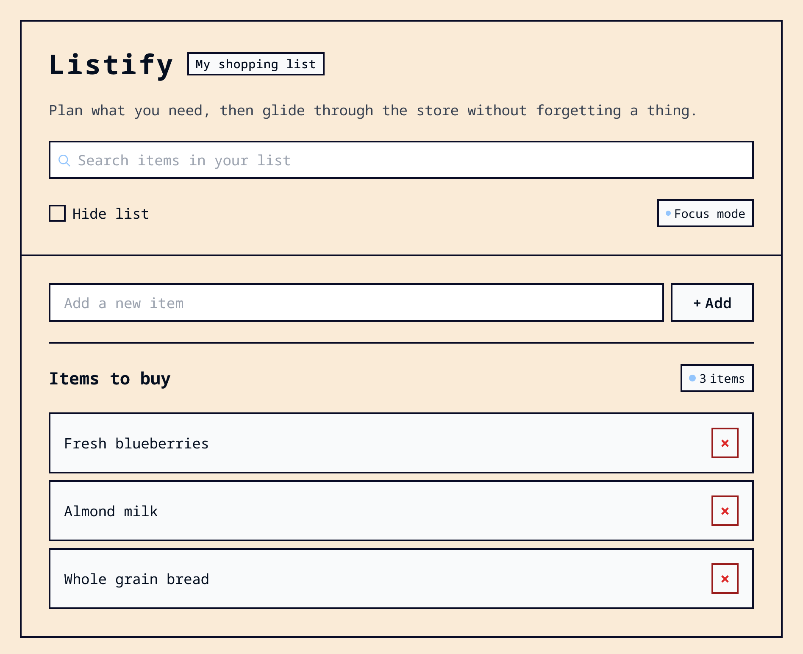

# Listify - Shopping List Component

A modern, responsive shopping list application built with vanilla JavaScript. Plan what you need, then glide through the store without forgetting a thing.



## Features

- ✅ **Add Items** - Quickly add new items to your shopping list
- 🗑️ **Delete Items** - Remove items with a single click
- 🔍 **Live Search** - Filter items in real-time as you type
- 👁️ **Hide List** - Toggle list visibility with smooth fade animation
- 📊 **Item Counter** - Automatically updates with singular/plural handling
- 📱 **Fully Responsive** - Optimized for all screen sizes
- ♿ **Accessible** - Built with semantic HTML and ARIA attributes

## Technologies Used

- **HTML5** - Semantic markup
- **CSS3** - Modern CSS with custom properties, Grid, and Flexbox
- **Vanilla JavaScript** - ES6+ modules, no frameworks
- **Vite** - Fast build tool and dev server

## Project Structure

```
Shopping List Component/
├── index.html          # Main HTML file
├── src/
│   ├── main.js         # Application entry point
│   ├── index.css       # CSS imports
│   ├── style.css       # Main stylesheet
│   ├── modern-css-reset.css  # CSS reset
│   ├── preview.png     # Preview image
│   └── modules/        # Modular JavaScript files
│       ├── dom.js      # DOM element references
│       ├── events.js   # Event listeners setup
│       ├── filter.js   # Search filtering functionality
│       ├── items.js    # Item operations (add, delete, create)
│       ├── utils.js    # Utility functions
│       └── visibility.js # Toggle visibility functionality
├── package.json
└── vite.config.js
```

## Installation

1. Clone or download the project
2. Install dependencies:

```bash
npm install
```

## Usage

### Development

Start the development server:

```bash
npm run dev
```

The app will be available at `http://localhost:5173` (or the port Vite assigns).

### Build

Create a production build:

```bash
npm run build
```

### Preview

Preview the production build:

```bash
npm run preview
```

## Features in Detail

### Add Items

- Type an item name in the input field
- Press Enter or click the "Add" button
- The item is added to the list and the count updates automatically

### Delete Items

- Click the × button on any item to remove it
- The item count updates automatically with proper singular/plural text

### Search/Filter

- Type in the search input to filter items in real-time
- Case-insensitive partial matching
- Items that don't match are hidden

### Hide List

- Toggle the "Hide list" checkbox to show/hide the items section
- Smooth fade animation when toggling

## Responsive Design

The application is fully responsive with breakpoints at:

- **Small screens (≤ 768px)**: Optimized mobile layout

  - Smaller fonts and spacing
  - Stacked form layout
  - Hidden badge on title
  - Full-width container

- **Very small screens (≤ 360px)**: Ultra-compact layout
  - Centered header content
  - Stacked controls and headings
  - Maximum space efficiency

## Accessibility Features

- Semantic HTML5 elements
- ARIA labels and roles
- Skip link for keyboard navigation
- Focus management
- Screen reader friendly
- Keyboard accessible
- Proper form labels

## Browser Support

Modern browsers that support:

- ES6+ JavaScript
- CSS Grid and Flexbox
- CSS Custom Properties (Variables)

## License

This project is for educational purposes.

## Credits

This component is inspired by a practice project from the [Build Dynamic Websites with DOM Manipulation](https://www.udemy.com/course/build-dynamic-websites-dom-2/) course on Udemy.
